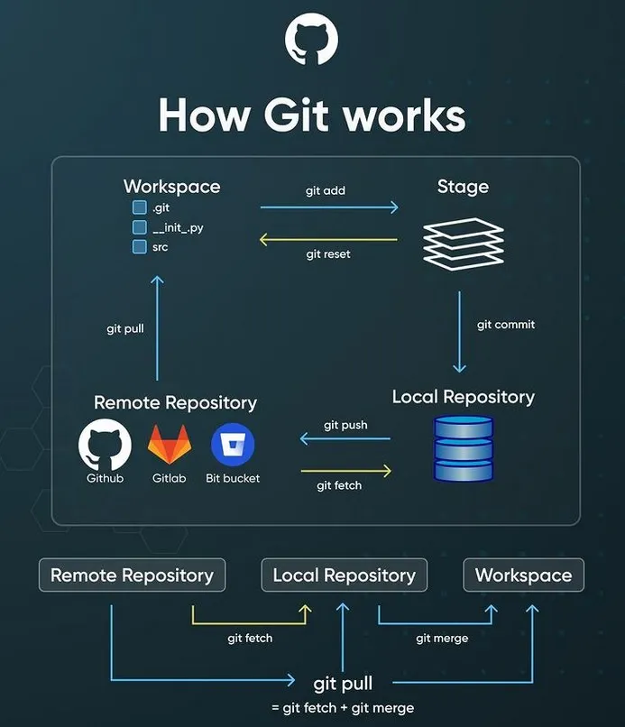

# XpeLab Maîtriser Git

Un peu de contexte et d'histoire.

## Introduction

C'est quoi Git ? D'où ça vient ? C'est pour quoi faire ? Et pourquoi c'est important de le maîtriser ?

### C'est quoi Git ?

Git est un système de contrôle de version distribué. Il permet de suivre les modifications apportées à des fichiers et de collaborer avec d'autres personnes sur des projets de développement logiciel. Git a été créé par Linus Torvalds en 2005 pour gérer le développement du noyau Linux.

### D'où ça vient ?

Git a été créé par Linus Torvalds, le créateur du noyau Linux, en 2005. Il a développé Git pour répondre aux besoins de gestion de version du projet Linux, qui était devenu trop grand et complexe pour les systèmes de contrôle de version existants à l'époque.

### C'est pour quoi faire ?

Git est utilisé pour gérer les versions de code source dans les projets de développement logiciel. Il permet aux développeurs de suivre les modifications apportées au code, de collaborer avec d'autres développeurs, de fusionner des branches de développement, et de revenir à des versions précédentes du code si nécessaire.

### Pourquoi c'est important de le maîtriser ?

Maîtriser Git est essentiel pour tout développeur, car cela permet de travailler efficacement en équipe, de gérer les versions de code de manière organisée, et de résoudre les conflits de manière efficace. Cela facilite également la collaboration sur des projets open source et la gestion de projets complexes.

## La documentation officielle

La documentation officielle de Git est disponible sur le site officiel de Git : [https://git-scm.com/doc](https://git-scm.com/doc). Elle fournit des informations détaillées sur l'installation, les commandes, les concepts clés, et les meilleures pratiques pour utiliser Git.

## Un peu de vocabulaire

Voici quelques termes clés liés à Git :

- **Repository (Repo)** : Un dépôt Git est un espace de stockage pour les fichiers et l'historique des modifications d'un projet.
- **Commit** : Un commit est une capture de l'état actuel du code à un moment donné. Il inclut un message de commit qui décrit les modifications apportées.
- **Branch** : Une branche est une ligne de développement indépendante. Elle permet de travailler sur des fonctionnalités ou des corrections sans affecter la branche principale (généralement appelée "main" ou "master").
- **Merge** : Le processus de fusion de deux branches pour intégrer les modifications d'une branche dans une autre.
- **Pull Request (PR)** : Une demande de tirage est une proposition de modification qui permet à d'autres développeurs de revoir et de discuter des changements avant de les fusionner dans la branche principale (spécifique Github).
- **Clone** : Copier un dépôt Git existant sur votre machine locale.
- **Push** : Envoyer les commits locaux vers un dépôt distant.
- **Pull** : Récupérer les modifications d'un dépôt distant et les intégrer dans votre branche locale.
- **Staging Area** : Un espace temporaire où les modifications sont préparées avant d'être commités.
- **Conflict** : Un conflit se produit lorsque deux branches ont des modifications incompatibles sur les mêmes lignes de code, nécessitant une résolution manuelle.
- **Tag** : Un tag est une référence à un commit spécifique, souvent utilisé pour marquer des versions de release.
- **Remote** : Un dépôt distant est une version du dépôt Git qui est hébergée sur un serveur, permettant la collaboration entre plusieurs développeurs.
- **Fork** : Un fork est une copie d'un dépôt Git qui permet à un développeur de proposer des modifications sans affecter le dépôt original (spécifique Github).
- **Rebase** : Le processus de réappliquer les commits d'une branche sur une autre base, souvent utilisé pour maintenir un historique de commit plus propre.
- **Cherry-pick** : Le processus de sélectionner des commits spécifiques d'une branche et de les appliquer à une autre branche.
- **Blame** : Une fonctionnalité qui permet de voir qui a modifié chaque ligne d'un fichier et quand.
- **Log** : Un journal des commits qui montre l'historique des modifications dans un dépôt Git.
- **Diff** : Un outil qui montre les différences entre deux versions de fichiers ou de commits.
- **Stash** : Un mécanisme pour sauvegarder temporairement des modifications non commités afin de pouvoir les appliquer plus tard.
- **HEAD** : Un pointeur qui indique la branche ou le commit actuellement actif dans le dépôt Git.
- **Gitflow** : Un modèle de branchement populaire qui définit des règles pour la gestion des branches dans un projet Git.

Et bien d'autres...

## Une image vaut mille mots



## Apprendre Git

[learngitbranching](https://learngitbranching.js.org/) est un excellent outil interactif pour apprendre Git. Il propose des exercices pratiques pour comprendre les concepts de base et les commandes Git.

## Cheat sheet

[git-cheat-sheet](./docs/git-cheat-sheet.pdf)

## En pratique

On va faire du Git ! On va créer un dépôt, faire des commits, créer des branches, fusionner des branches, et résoudre des conflits. On va aussi utiliser GitHub pour collaborer avec d'autres développeurs.

### Exercice 1 : Créer un dépôt Git

1. Ouvrez votre terminal et naviguez vers le répertoire où vous souhaitez créer votre projet.
2. Exécutez la commande suivante pour initialiser un nouveau dépôt Git :
```bash
git init
```
3. Créez un fichier `README.md` et ajoutez du contenu à ce fichier.
4. Ajoutez le fichier au staging area :
```bash
git add README.md
```
5. Faites un commit pour enregistrer les modifications :
```bash
git commit -m "Initial commit: Add README.md"
```

### Exercice 2 : Clonez ce repo sur Github

1. Clonez ce dépôt sur votre machine locale :
```bash
git clone https://github.com/XPEHO/xpelab_git.git
```

2. Naviguez dans le répertoire cloné :
```bash
cd xpelab_git
```

### Exercice 3 : Créer une branche et faire une pull request

1. Créez une nouvelle branche pour travailler sur une fonctionnalité :

```bash
git checkout -b feature/new-feature
```

2. Faites des modifications dans CHANGELOG, ajoutez les fichiers modifiés au staging area, et faites un commit :

```bash
git add .
git commit -m "Add new feature"
```

3. Poussez la branche vers le dépôt distant :

```bash
git push origin feature/new-feature
```

> **Pro tip**
>
> Activez l'option `push.autoSetupRemote` pour que Git configure automatiquement la branche distante lors du push de votre branche locale pour la première fois :

```bash
git config --global push.autoSetupRemote true
```

4. Créez une pull request sur GitHub pour fusionner votre branche dans la branche principale.

### Exercice 4 : Résoudre un conflit de fusion

1. Créez une nouvelle branche à partir de la branche principale et faites des modifications dans le même fichier que celui modifié dans la branche précédente.

2. Faites un commit et poussez la branche vers le dépôt distant.

3. Essayez de fusionner la branche précédente dans la branche principale. Vous devriez rencontrer un conflit de fusion.

### Excercice 5 : Utiliser le rebase

1. Créez une nouvelle branche à partir de la branche principale et faites des modifications.

2. Faites un commit et poussez la branche vers le dépôt distant.

3. Poussez votre branche vers le dépôt distant.

4. Utilisez la commande `git rebase` pour réappliquer vos commits sur la branche principale.

5. Résolvez les conflits de rebase si nécessaire, puis poussez les modifications rebased vers le dépôt distant.

### Exercice 6 : Utiliser le stash

1. Faites des modifications sur la branche principale sans les committer.

2. Utilisez la commande `git stash` pour sauvegarder temporairement vos modifications.

3. Récupérez les modifications de la branche distante et fusionnez-les dans votre branche locale via `git pull`.

4. Sortez les modifications stashed et appliquez-les à votre branche locale avec `git stash pop`.

## Exercice 7 : Annuler un add ou un commit

1. Faites des modifications dans un fichier et ajoutez-le au staging area avec `git add`.

2. Si vous avez ajouté un fichier par erreur, utilisez la commande `git reset` pour le retirer du staging area :

```bash
git reset HEAD <file>
```

3. Si vous avez fait un commit par erreur, utilisez la commande `git reset` pour annuler le commit et revenir à l'état précédent :

```bash
git reset --soft HEAD~1
```

Les modifications du commit annulé seront conservées dans le staging area, vous permettant de les modifier ou de les committer à nouveau.

## Exercice 8 : Annuler toutes vos modifications (DANGER)

1. Faites des modifications dans un fichier.

2. Commitez les modifications.

3. Si vous souhaitez annuler toutes les modifications et revenir à l'état du dernier commit, utilisez la commande `git reset` avec l'option `--hard` :

```bash
git reset --hard HEAD
```

## Exercice 9 : Annuler un commit déjà poussé (DANGER)

1. Faites des modifications dans un fichier et commitez-les.

2. Poussez les modifications vers le dépôt distant.

3. Si vous souhaitez annuler le commit déjà poussé, utilisez la commande `git revert` pour créer un nouveau commit qui annule les modifications du commit précédent :

```bash
git revert <commit-hash>
```

## Exercice 10 : Le rebase interactif

### Squash des commits

1. Faites plusieurs commits pour une fonctionnalité ou une correction de bug.

2. Utilisez la commande `git rebase -i` pour lancer un rebase interactif et squasher les commits en un seul commit :

```bash
git rebase -i HEAD~n
```

Où `n` est le nombre de commits que vous souhaitez inclure dans le rebase interactif.

### Changer l'ordre des commits, modifier les messages de commit, ou supprimer des commits

1. Utilisez la commande `git rebase -i` pour lancer un rebase interactif et modifier l'ordre des commits, les messages de commit, ou supprimer des commits :

```bash
git rebase -i HEAD~n
```

Où `n` est le nombre de commits que vous souhaitez inclure dans le rebase interactif.

## Exercice 11 : Ouvrir un commit en deux

1. Faites un commit avec plusieurs modifications.

2. Annulez le commit avec `git reset --soft HEAD~1` pour revenir à l'état avant le commit, tout en conservant les modifications dans le staging area.

3. Utilisez `git add <fichier>` pour sélectionner les modifications que vous souhaitez inclure dans le premier commit, puis faites un commit.

4. Répétez le processus pour les modifications restantes afin de créer un deuxième commit.

5. Poussez les commits vers le dépôt distant.